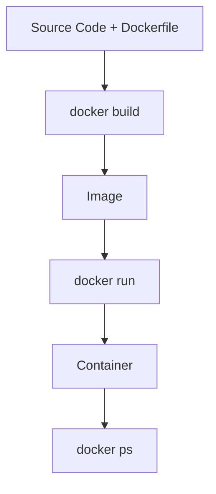

# 🐳 How Docker Works

## 1. Write your code 💻
Example project structure:
```
📂my-app
    └── 📂src/
    └── 🐳Dockerfile
```

---

## 2. Build the Image 📦
```bash
docker build -t my-app .
```
🔹 Packages your app + environment → creates an **image**.

---

## 3. Run a Container ▶️
```bash
docker run -d --name my-app-container my-app
```
🔹 Starts a **container** (running instance of the image).

---

## 4. Check Running Containers 🔍
```bash
docker ps
```
🔹 Shows active containers (processes).

---

# 📊 Docker Container: Simple Process Flow (Build → Run → Container)


