# 🧠 Mastering Conditions & `switch` Statements in JavaScript (With Functions!)

Conditional logic is the decision-maker of your code — it decides **what happens and when**. Whether you’re building a game, handling user input, or working with APIs, you'll constantly need to ask questions like:

- "Is the user logged in?"
- "Is the score high enough to win?"
- "What action should I take based on this value?"

Conditional logic allows you to **control the flow** of your application based on **data and decisions**. In this guide, we'll explore:

- `if...else` and `switch` structures
- Real-world, object-based decision logic
- Logical & relational operator cheat sheet
- Function-based examples to improve reusability

---

## 🟢 1. Basic `if...else` Condition

### ✅ Flat Example

```js
let age = 18;

if (age >= 18) {
  console.log("You're allowed to vote!");
} else {
  console.log("Sorry, you're too young to vote.");
}
```

### 🔽 Visual Flow (if...else)


### 🔁 Function Version

```js
function checkVotingEligibility(age) {
  if (age >= 18) {
    return "You're allowed to vote!";
  } else {
    return "Sorry, you're too young to vote.";
  }
}

console.log(checkVotingEligibility(20));  // ✅
console.log(checkVotingEligibility(16));  // ❌
```

---

## 🌡️ 2. Multiple Conditions

### ✅ Flat Example

```js
let temperature = 15;

if (temperature < 0) {
  console.log("Freezing 🧊");
} else if (temperature < 20) {
  console.log("Cool 😎");
} else {
  console.log("Warm ☀️");
}
```

### 🔁 Function Version

```js
function describeTemperature(temp) {
  if (temp < 0) return "Freezing 🧊";
  else if (temp < 20) return "Cool 😎";
  else return "Warm ☀️";
}

console.log(describeTemperature(25));
```

---

## ⚙️ 3. Logical Operators in Action

### ✅ Flat Example

```js
let isLoggedIn = true;
let hasSubscription = false;

if (isLoggedIn && hasSubscription) {
  console.log("Access granted ✅");
} else {
  console.log("Access denied 🚫");
}
```

### 🔁 Function Version

```js
function canAccessContent(isLoggedIn, hasSubscription) {
  return isLoggedIn && hasSubscription
    ? "Access granted ✅"
    : "Access denied 🚫";
}

console.log(canAccessContent(true, false));
```

---

## 📊 Logical & Relational Operator Cheat Sheet

| Operator | Name                  | Example           | Meaning                         |
|----------|-----------------------|-------------------|---------------------------------|
| `==`     | Equal to              | `5 == '5'`        | `true` (type coercion)          |
| `===`    | Strictly equal to     | `5 === '5'`       | `false` (no type coercion)      |
| `!=`     | Not equal to          | `5 != '5'`        | `false`                         |
| `!==`    | Strictly not equal to | `5 !== '5'`       | `true`                          |
| `>`      | Greater than          | `10 > 5`          | `true`                          |
| `<`      | Less than             | `10 < 5`          | `false`                         |
| `>=`     | Greater or equal      | `10 >= 10`        | `true`                          |
| `<=`     | Less or equal         | `7 <= 10`         | `true`                          |
| `&&`     | Logical AND           | `true && false`   | `false`                         |
| `||`     | Logical OR            | `true || false`   | `true`                          |
| `!`      | Logical NOT           | `!true`           | `false`                         |

---

## 👤 4. Real-World Example: User Access

### ✅ Flat Example

```js
let user = {
  name: "Alex",
  isAdmin: false,
  isPremium: true
};

if (user.isAdmin) {
  console.log("Welcome, Admin!");
} else if (user.isPremium) {
  console.log("Welcome, Premium user!");
} else {
  console.log("Welcome, Guest!");
}
```

### 🔁 Function Version

```js
function getWelcomeMessage(user) {
  if (user.isAdmin) return "Welcome, Admin!";
  if (user.isPremium) return "Welcome, Premium user!";
  return "Welcome, Guest!";
}

console.log(getWelcomeMessage({ name: "Alex", isAdmin: false, isPremium: true }));
```

---

## 🎚️ 5. Using `switch`

### ✅ Flat Example

```js
let day = "Friday";

switch (day) {
  case "Monday":
    console.log("Start of the week 💼");
    break;
  case "Friday":
    console.log("Almost weekend 🍻");
    break;
  case "Saturday":
  case "Sunday":
    console.log("Weekend mode 🛋️");
    break;
  default:
    console.log("Just another day 💤");
}
```

### 🔽 Visual Flow (switch statement)

```mermaid
flowchart TD
  S[Day of the Week] --> M[Monday]
  S --> F[Friday]
  S --> W[Saturday or Sunday]
  S --> D[Default]
  M --> R1["Start of the week 💼"]
  F --> R2["Almost weekend 🍻"]
  W --> R3["Weekend mode 🛋️"]
  D --> R4["Just another day 💤"]
```



### 🔁 Function Version

```js
function describeDay(day) {
  switch (day) {
    case "Monday":
      return "Start of the week 💼";
    case "Friday":
      return "Almost weekend 🍻";
    case "Saturday":
    case "Sunday":
      return "Weekend mode 🛋️";
    default:
      return "Just another day 💤";
  }
}

console.log(describeDay("Sunday"));
```

---

## 🧠 6. Practical Support Request (Improved Real-World Example)


### 🔽 Visual Flow (Support Request Routing)


```js
function redirectToDepartment(deptCode, userName, priority) {
  console.log(`🔁 Redirecting ${userName} to the ${deptCode} department...`);
  console.log(`📌 Priority: ${priority}`);
  // TODO: Add actual routing logic here, such as:
  // routeTo(deptCode, userName, priority)
}

function handleSupportRequest(supportRequest) {
  const { userName, requestType, priority } = supportRequest;

  switch (requestType) {
    case "technical":
      redirectToDepartment("Technical Support", userName, priority);
      break;
    case "billing":
      redirectToDepartment("Billing", userName, priority);
      break;
    case "sales":
      redirectToDepartment("Sales", userName, priority);
      break;
    default:
      console.log(`❓ Sorry ${userName}, we couldn't identify your request type.`);
      console.log("Please contact our general support.");
  }
}

// Example usage
const request1 = {
  userName: "Alice",
  requestType: "technical",
  priority: "high"
};

const request2 = {
  userName: "Bob",
  requestType: "billing",
  priority: "low"
};

const request3 = {
  userName: "Charlie",
  requestType: "unknown",
  priority: "medium"
};

handleSupportRequest(request1);
handleSupportRequest(request2);
handleSupportRequest(request3);
```

---

## 🧠 Try It Yourself

✅ **Exercise 1:** Write a function that receives a grade (A–F) and returns feedback using `switch`.  
✅ **Exercise 2:** Refactor it to use an object map instead of `switch`.  
✅ **Exercise 3:** Create a `checkPermissions(role, action)` function that uses logical operators (`&&`, `||`) to decide access.

---

## 🏁 Final Words

- Use `if...else` for general conditions.
- Use `switch` for comparing one value to many possibilities.
- Prefer object maps for cleaner, scalable alternatives.
- Wrap logic in reusable functions for real-world use.

Happy Coding! 🚀
